# TECHNICAL SPECIFICATION: MULTIPLAYER SYSTEM (NGO)

> **Feature:** Online Turn-Based Multiplayer via Unity Netcode for GameObjects (NGO)  
> **Status:** Specification / Ready for Implementation  
> **Target Platform:** PC / WebGL / Mobile (Cross-Platform NGO Architecture)  
> **Framework:** Unity Netcode for GameObjects (`com.unity.netcode.gameobjects` v2.13.2) + Unity Transport (`UnityTransport`)  
> **Author:** Antigravity AI & Development Team  
> **Last Updated:** September 2026  

---

## 1. Executive Summary & Goals

### 1.1 Objective
Transform the existing local dynamic Tic Tac Toe game into an online peer-to-peer (Host-Client) multiplayer experience using Unity's official **Netcode for GameObjects (NGO)**. 

### 1.2 Design Philosophy: Pragmatic & Non-Overengineered
1. **Right & Sufficient (KISS & YAGNI):** Tic Tac Toe is a discrete, low-frequency turn-based game (at most 1 move every few seconds). It does **not** require physics prediction, client-side rollbacks, lag compensation, or tick-level reconciliation. A lightweight Authoritative Listen Server with reliable RPCs is the mathematically optimal choice.
2. **Preserve Existing Decoupled Code (Open/Closed Principle):** The presentation layer (`GameVisualManager`, `GameTurnUI`, `RematchUI`, `BoardGenerator`) already listens strictly to C# events on `GameManager`. The multiplayer implementation must **not rewrite or break** these presentation scripts.
3. **Dual-Mode Compatibility:** The game must seamlessly support both **Offline Local Hotseat** and **Online Multiplayer** without code branching chaos.
4. **Zero Magic Numbers:** All network timings, timeout thresholds, RPC IDs, and player roles must be defined as explicit, named constants.

---

## 2. Network Topology & Player Assignment

### 2.1 Authoritative Listen-Server (Host + Client)
```
+-----------------------------------------------------------+
|                          HOST                             |
|  - Acts as Server (State Authority & Validation)          |
|  - Acts as Local Player 1 (Cross / 'X')                  |
|  - NetworkManager.Singleton.StartHost()                  |
+-----------------------------+-----------------------------+
                              ^
                              | UDP / UTP (Port 7777 / Relay)
                              v
+-----------------------------+-----------------------------+
|                         CLIENT                            |
|  - Acts as Remote Player 2 (Circle / 'O')                 |
|  - Submits moves via ServerRpc                            |
|  - NetworkManager.Singleton.StartClient()                |
+-----------------------------------------------------------+
```

### 2.2 Role Assignment Protocol
- **Host (Server):**
  - Always assigned `PlayerType.Cross` (`NetworkManager.ServerClientId` = 0).
  - First turn defaults to `PlayerType.Cross`.
- **Connecting Client:**
  - Assigned `PlayerType.Circle` (`clientId` > 0).
  - Maximum player capacity for a match session: **2 players** (Host + 1 Client).
  - Connection approval callback rejects any 3rd player trying to join an ongoing match.

---

## 3. Architecture & Class Design

### 3.1 Network Architecture Overview
We follow the **Adapter & Observer Pattern** to bridge NGO networking with existing game logic.

```
                           [ Player Input ]
                                  |
                                  v
                      [ GridPosition.OnClick ]
                                  |
                                  v
                      +-----------------------+
                      |      GameManager      |
                      |  (NetworkBehaviour)   |
                      +-----------------------+
                       /                     \
      (If Local / Offline)                 (If Online / Networked)
             /                                         \
    ProcessMoveLocally()                    SubmitMoveServerRpc(x, y)
             |                                          |
             |                                    [Server Validate]
             |                                          |
             |                             +------------+------------+
             |                             |                         |
             |                   Host executes move        Broadcast to Client
             |                   OnClickedOnGridPosition   ExecuteMoveClientRpc(x, y)
             |                             |                         |
             \-----------------------------+-------------------------/
                                           |
                                [ C# Action Events ]
               ---------------------------------------------------------
               |                           |                           |
               v                           v                           v
      [ GameVisualManager ]          [ GameTurnUI ]             [ RematchUI ]
      Spawns visual 3D/2D 'X'/'O'    Updates active arrow        Shows rematch panel
```

### 3.2 Key Classes & Responsibilities

#### A. `NetworkGameManager` (or refactored `GameManager : NetworkBehaviour`)
- **Authority:** Validates all moves on the Server.
- **State Synchronization:**
  - `NetworkVariable<PlayerType> currentTurn`: Synchronizes the active turn so clients always display the correct TurnUI.
  - `NetworkVariable<GameState> currentGameState`: (`WaitingForPlayer`, `Playing`, `GameOver`).
- **RPCs:**
  - `[ServerRpc(RequireOwnership = false)] SubmitMoveServerRpc(int x, int y, ServerRpcParams rpcParams = default)`
  - `[ClientRpc] ExecuteMoveClientRpc(int x, int y, PlayerType player)`
  - `[ClientRpc] TriggerGameWinClientRpc(int startX, int startY, int endX, int endY, PlayerType winner, WinOrientation orientation)`
  - `[ClientRpc] TriggerGameTiedClientRpc()`
  - `[ServerRpc(RequireOwnership = false)] RequestRematchServerRpc(ServerRpcParams rpcParams = default)`
  - `[ClientRpc] ResetGameClientRpc()`

#### B. `NetworkManagerUI` (or Integration with Khang's Menu)
- Provides simple Host / Client buttons for development & testing.
- Hooks cleanly into Khang's `MainMenuController` / `StartMatchCommand`.
- Displays connection status: *Connecting...*, *Waiting for Opponent...*, *Connected*, *Disconnected*.

---

## 4. Sequence Diagrams

### 4.1 Turn & Move Execution Flow

```mermaid
sequenceDiagram
    autonumber
    actor ClientPlayer as Client (Player O)
    participant ClientGM as Client GameManager
    participant ServerGM as Host GameManager (Server)
    actor HostPlayer as Host (Player X)

    Note over HostPlayer,ClientPlayer: Game State: Playing, Turn: Player O
    ClientPlayer->>ClientGM: Clicks cell (x=1, y=2)
    ClientGM->>ServerGM: SubmitMoveServerRpc(1, 2, senderId)
    
    rect rgb(30, 45, 60)
        Note over ServerGM: Server Validation:
        Note over ServerGM: 1. Is Sender ID matched with Current Turn?
        Note over ServerGM: 2. Is cell (1, 2) empty?
        Note over ServerGM: 3. Is Game State == Playing?
    end

    alt Validation Failed (Invalid Move / Cheat / Lag)
        ServerGM-->>ClientGM: [Optional] MoveRejectedClientRpc() (or ignore)
    else Validation Succeeded
        ServerGM->>ServerGM: Update board[1, 2] = Player O
        ServerGM->>ServerGM: Check Win / Tie condition
        ServerGM->>ServerGM: Trigger local OnClickedOnGridPosition(1, 2, Player O)
        ServerGM->>ClientGM: ExecuteMoveClientRpc(1, 2, Player O)
        ClientGM->>ClientGM: Trigger local OnClickedOnGridPosition(1, 2, Player O)
        
        Note over HostPlayer,ClientPlayer: Both VisualManagers spawn 'O' at (1, 2)
        
        alt Win Condition Met
            ServerGM->>ServerGM: TriggerOnGameWin(winningLine, Player O)
            ServerGM->>ClientGM: TriggerGameWinClientRpc(lineData, Player O)
        else Tie Condition Met
            ServerGM->>ServerGM: TriggerOnGameTied()
            ServerGM->>ClientGM: TriggerGameTiedClientRpc()
        else Next Turn
            ServerGM->>ServerGM: Toggle currentTurn -> Player X
            Note over HostPlayer,ClientPlayer: TurnUI updates indicator to Player X
        end
    end
```


### 4.2 Rematch Handshake Protocol

```mermaid
sequenceDiagram
    autonumber
    actor Host as Host (Player X)
    participant Server as Server Logic
    actor Client as Client (Player O)

    Note over Host,Client: Game Over State
    Client->>Server: RequestRematchServerRpc()
    Server->>Server: clientWantsRematch = true
    Server->>Host: NotifyRematchRequestedUI(Player O)
    
    Host->>Server: Host clicks Rematch -> RequestRematchServerRpc()
    Server->>Server: hostWantsRematch = true
    
    rect rgb(20, 60, 30)
        Note over Server: Both players agreed! Reset board.
        Server->>Server: ResetBoardLocally()
        Server->>Client: ResetGameClientRpc()
    end
    
    Note over Host,Client: RematchUI hides, grid clears, new match begins!
```


---

## 5. Data Contracts & RPC Specifications

### 5.1 Remote Procedure Calls (RPC)
```csharp
// Sent from Client or Host to Server
[ServerRpc(RequireOwnership = false)]
public void SubmitMoveServerRpc(int x, int y, ServerRpcParams rpcParams = default)
{
    ulong senderClientId = rpcParams.Receive.SenderClientId;
    PlayerType senderType = GetPlayerTypeForClientId(senderClientId);

    // 1. Turn Check
    if (senderType != currentTurn.Value) return;

    // 2. Cell Check
    if (grid[x, y] != PlayerType.None) return;

    // 3. State Check
    if (currentGameState.Value != GameState.Playing) return;

    // Execute Move Authoritatively
    ApplyMove(x, y, senderType);
}

// Broadcast from Server to all Clients
[ClientRpc]
public void ExecuteMoveClientRpc(int x, int y, PlayerType player)
{
    // Simply fire the existing C# event!
    // GameVisualManager will automatically instantiate the icon!
    OnClickedOnGridPosition?.Invoke(x, y, player);
}
```

### 5.2 Winning Line Serialization Contract
To avoid sending complex Unity objects over the network, serialize winning lines using pure primitive integers:
```csharp
public struct NetworkLineData : INetworkSerializable
{
    public int startX;
    public int startY;
    public int endX;
    public int endY;
    public WinOrientation orientation; // Horizontal, Vertical, DiagonalMain, DiagonalAnti

    public void NetworkSerialize<T>(BufferSerializer<T> serializer) where T : IReaderWriter
    {
        serializer.SerializeValue(ref startX);
        serializer.SerializeValue(ref startY);
        serializer.SerializeValue(ref endX);
        serializer.SerializeValue(ref endY);
        serializer.SerializeValue(ref orientation);
    }
}
```

---

## 6. Constants & Configuration (No Magic Numbers)

Create a dedicated static configuration class `MultiplayerConstants.cs`:

```csharp
public static class MultiplayerConstants
{
    // Network Settings
    public const ushort DEFAULT_PORT = 7777;
    public const string DEFAULT_IP = "127.0.0.1";
    public const int MAX_PLAYERS = 2;
    public const float CONNECTION_TIMEOUT_SECONDS = 10.0f;
    
    // Client IDs
    public const ulong HOST_CLIENT_ID = 0;
    
    // Grid Coordinates
    public const int INVALID_COORDINATE = -1;
    
    // Scene Names
    public const string SCENE_MAIN_MENU = "MainMenuScene";
    public const string SCENE_GAMEPLAY = "SampleScene";
}
```

---

## 7. Error Handling, Edge Cases & Disconnection

| Edge Case | Failure Mode | Mitigation Strategy |
| :--- | :--- | :--- |
| **Client Disconnects Mid-game** | Host is left playing alone. | Server listens to `NetworkManager.OnClientDisconnectCallback`. Notify Host via UI (*'Opponent disconnected'*), grant default win or prompt return to menu. |
| **Host Disconnects / Closes** | Client gets frozen in game. | Client listens to `OnClientDisconnectCallback`. Show dialog (*'Host disconnected'*), reset local state, load `MainMenuScene`. |
| **Rapid Double-Clicking** | Client sends 2 RPCs before server responds. | Server validates `grid[x, y] == None` atomically; second RPC is discarded with 0 side effects. |
| **Malicious Move Injection** | Hacked client sends out-of-turn or out-of-bounds coordinates. | Server bounds-checks `0 <= x < boardSize` and validates sender client ID against `currentTurn`. |
| **3rd Player Joins Session** | Match capacity overflow. | Set `NetworkManager.NetworkConfig.ConnectionApproval = true`. In approval check: if `ConnectedClientsIds.Count >= 2`, reject connection. |

---

## 8. Integration with Khang's Menu Architecture

Khang's menu system uses the **Command Pattern** (`ICommand`) and **State Pattern** (`IMenuState`).
Multiplayer integrates cleanly by adding a dedicated command:

```csharp
public class StartOnlineMatchCommand : ICommand
{
    private readonly bool isHost;
    private readonly string targetIp;

    public StartOnlineMatchCommand(bool isHost, string targetIp = MultiplayerConstants.DEFAULT_IP)
    {
        this.isHost = isHost;
        this.targetIp = targetIp;
    }

    public void Execute()
    {
        if (isHost)
        {
            NetworkManager.Singleton.StartHost();
        }
        else
        {
            var transport = NetworkManager.Singleton.GetComponent<UnityTransport>();
            transport.SetConnectionData(targetIp, MultiplayerConstants.DEFAULT_PORT);
            NetworkManager.Singleton.StartClient();
        }
    }
}
```

---

## 9. Implementation Roadmap & Milestones

### Phase 1: NGO Setup & Core Prefabs (Milestone 1)
- [x] Add `NetworkManager` GameObject to `SampleScene` (or persistent bootstrap).
- [x] Configure `UnityTransport` (UDP, 127.0.0.1, Port 7777).
- [x] Create `MultiplayerConstants.cs` for all configuration constants.

### Phase 2: GameManager Network Integration (Milestone 2)
- [x] Inherit `GameManager` from `NetworkBehaviour`.
- [x] Implement `SubmitMoveServerRpc` with full server-side validation.
- [x] Implement `ExecuteMoveClientRpc` to broadcast moves.
- [x] Verify that `GameVisualManager` and `GameTurnUI` react with zero changes!

### Phase 3: Game Flow Synchronization (Milestone 3)
- [x] Sync Win / Tie detection across Host & Client via RPC.
- [x] Implement two-player Rematch handshake protocol.
- [x] Sync Rematch button state via `RematchUI`.

### Phase 4: Menu & Disconnection Polish (Milestone 4)
- [x] Connect Khang's `Play Online` menu button to `StartOnlineMatchCommand`.
- [x] Add disconnect callbacks and return-to-menu UI alerts.
- [x] Test with Unity ParrelSync / MPPM or Standalone Build + Unity Editor.
