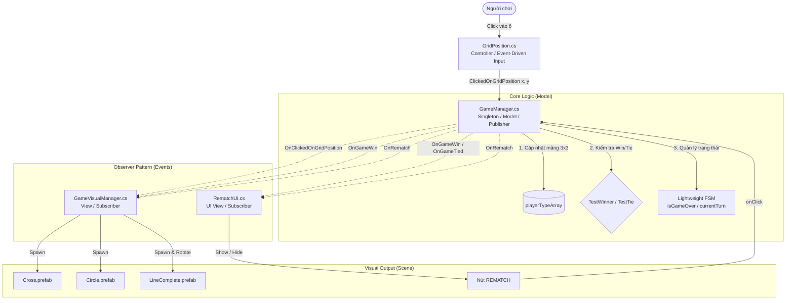

# BÁO CÁO KIẾN TRÚC PHẦN MỀM & THIẾT KẾ DỰ ÁN TIC TAC TOE (UNITY)

> **Mục đích tài liệu:** Bản tóm tắt kiến trúc kỹ thuật toàn diện về dự án Game Tic Tac Toe (Cờ ca-rô 3x3) được xây dựng trên Unity Engine. Tài liệu được biên soạn chi tiết nhằm cung cấp ngữ cảnh kỹ thuật đầy đủ để sinh báo cáo chuyên đề, tiểu luận, slide thuyết trình hoặc tài liệu thiết kế phần mềm (Software Design Document - SDD).

---

## 1. TỔNG QUAN DỰ ÁN (PROJECT OVERVIEW)

- **Tên dự án:** Tic Tac Toe Multiplayer (Bản nguyên mẫu 2D hoàn chỉnh).
- **Nguồn cảm hứng / Tài liệu tham khảo:** Chuỗi bài giảng của **Code Monkey** (*"How to make Simple Multiplayer Game! - Unity Tutorial Netcode for Game Objects"*).
- **Công nghệ & Môi trường phát triển:**
  - **Game Engine:** Unity 6 (Phiên bản `6000.3.15f1`).
  - **Render Pipeline:** Universal Render Pipeline (URP) - Cấu hình 2D Lit/Unlit Pipeline.
  - **Ngôn ngữ lập trình:** C# (Compiler Roslyn / .NET Standard).
  - **Hệ thống Input:** Unity **New Input System Package** (`com.unity.inputsystem` v1.19.0) kết hợp với `UnityEngine.EventSystems`. Loại bỏ hoàn toàn hệ thống cũ (`UnityEngine.Input` / `OnMouseDown`).
  - **Giao diện người dùng (UI):** Unity UI (uGUI) & TextMeshPro (`com.unity.ugui`).
  - **Định hướng mở rộng:** Netcode for GameObjects (NGO `com.unity.netcode.gameobjects` v2.13.2) & Unity Transport.

### Cấu trúc File Mã nguồn & Assets cốt lõi:

1. `Assets/Scripts/_Loc/GameManager.cs`: Bộ não điều khiển toàn bộ luật chơi, dữ liệu bàn cờ 3x3, lượt đi, thuật toán thắng/thua/hòa và hệ thống phát sự kiện (Publisher).
2. `Assets/Scripts/_Loc/GameVisualManager.cs`: Quản lý toàn bộ việc hiển thị hình ảnh (View), lắng nghe sự kiện để spawn prefab quân X, quân O và vạch kẻ chiến thắng `LineGreen`.
3. `Assets/Scripts/_Loc/GridPosition.cs`: Thành phần gắn trên từng ô cờ 3x3, tiếp nhận tương tác click chuột/cảm ứng thông qua New Input System và chuyển tiếp dữ liệu tọa độ `(x, y)` về `GameManager`.
4. `Assets/Scripts/_Loc/RematchUI.cs`: Bộ điều khiển giao diện UI nút bấm Chơi lại (Rematch), tự động ẩn/hiện có điều kiện dựa trên trạng thái kết thúc trận đấu.
5. **Prefabs:** `Cross.prefab` (Quân X), `Circle.prefab` (Quân O), `LineComplete.prefab` (Vạch chiến thắng), `GridPosition.prefab` (Ô tương tác).

---

## 2. PHÂN TÍCH CHI TIẾT CÁC DESIGN PATTERNS ĐƯỢC ÁP DỤNG

Dự án áp dụng kết hợp hài hòa 5 Design Patterns kinh điển nhằm đảm bảo mã nguồn mở rộng tốt, không bị phụ thuộc chéo (decoupled) và phục vụ hoàn hảo cho việc làm việc nhóm (Teamwork).



### Pattern 1: Observer Pattern (Publish - Subscribe)

- **Vấn đề giải quyết:** Khi người chơi đánh một nước cờ hoặc thắng trận, làm thế nào để hệ thống hiển thị (Visual), giao diện (UI) và sau này là âm thanh (Audio) biết được để cập nhật mà `GameManager` không cần phải kéo thả hay giữ tham chiếu trực tiếp tới các GameObject đó?
- **Cách cài đặt:**
  - **Publisher (`GameManager.cs`):** Định nghĩa và phát ra (Invoke) các C# `event EventHandler`:
    - `OnClickedOnGridPosition`: Kích hoạt khi có nước đi hợp lệ, truyền `(x, y, playerType)`.
    - `OnGameWin`: Kích hoạt khi phát hiện 3 quân thẳng hàng, truyền struct `Line` (tọa độ tâm, hướng quay) và `winPlayerType`.
    - `OnGameTied`: Kích hoạt khi 9 ô bị lấp đầy mà không ai thắng.
    - `OnCurrentPlayablePlayerTypeChanged`: Kích hoạt khi đổi lượt giữa X và O.
    - `OnRematch`: Kích hoạt khi ván đấu được làm mới.
  - **Subscribers (`GameVisualManager.cs`, `RematchUI.cs`):** Đăng ký lắng nghe tại hàm `Start()` và hủy đăng ký tại hàm `OnDestroy()` để chống rò rỉ bộ nhớ (Memory Leak).
- **Lợi ích kiến trúc:** Tách rời hoàn toàn (Decoupling) giữa Logic và Visual. Hai lập trình viên trong nhóm có thể code song song 2 file độc lập mà không bao giờ gặp xung đột mã nguồn (Merge Conflict).

### Pattern 2: Singleton Pattern

- **Vấn đề giải quyết:** `GameManager` là đối tượng điều phối duy nhất trong toàn bộ cảnh chơi (Scene). Làm sao để các ô cờ `GridPosition` và nút bấm UI `RematchUI` có thể gửi thông điệp tới `GameManager` nhanh nhất mà không phải kéo-thả Inspector cho 9 ô cờ riêng biệt?
- **Cách cài đặt:**
  ```csharp
  public static GameManager Instance { get; private set; }

  private void Awake() {
      if (Instance != null) {
          Debug.LogError("More than one GameManager instance!");
      }
      Instance = this;
      Init();
  }
  ```
- **Lợi ích kiến trúc:** Đảm bảo toàn bộ ứng dụng chỉ tồn tại duy nhất một phiên bản điều hành ván đấu; cung cấp điểm truy cập toàn cục (Global Access Point) tiện lợi và an toàn.

### Pattern 3: Mô hình Kiến trúc MVC (Model - View - Controller)

Hệ thống phân định ranh giới trách nhiệm cực kỳ rành mạch:

1. **Model (Dữ liệu & Nghiệp vụ):** `GameManager.cs`
   - Nắm giữ "sự thật" của trò chơi: dữ liệu mảng 3x3 `PlayerType[,]`, người chơi hiện tại, cờ kiểm soát trận đấu `isGameOver`.
   - Tính toán thuật toán chiến thắng và hòa cờ. Không chứa bất kỳ hàm `Instantiate` đồ họa nào.
2. **View (Hiển thị & Giao diện):** `GameVisualManager.cs` & `RematchUI.cs`
   - `GameVisualManager`: Chỉ nhận lệnh từ Event để sinh ra quân cờ tại tọa độ thế giới (World Position) và vẽ vạch `LineComplete`.
   - `RematchUI`: Chỉ quản lý việc hiển thị/ẩn nút bấm dựa trên sự kiện kết thúc ván đấu.
3. **Controller (Tiếp nhận tương tác & Điều hướng):** `GridPosition.cs`
   - Bắt tương tác vật lý/chuột từ người dùng và kích hoạt phương thức xử lý nghiệp vụ `ClickedOnGridPosition(x, y)` trên Model.

### Pattern 4: Lightweight Finite State Machine (Máy trạng thái hữu hạn tinh gọn)

- **Vấn đề giải quyết:** Một ván đấu Tic Tac Toe có các giai đoạn: Đang chờ -> Đang chơi -> Kết thúc. Làm sao quản lý luồng chuyển đổi trạng thái này mà không làm phức tạp hóa mã nguồn?
- **Cách cài đặt:** Thay vì tạo ra hàng loạt class phức tạp như GoF State Pattern (`PlayingState`, `GameOverState`), dự án sử dụng **State Machine dạng cờ/biến trạng thái tinh gọn**:
  - `isGameOver = false`: Trạng thái chơi (`Playing`) -> Các ô cờ nhận tương tác, lượt đánh luân chuyển.
  - `isGameOver = true`: Trạng thái kết thúc (`GameOver`) -> Khóa toàn bộ tương tác click trên bàn cờ, kích hoạt trạng thái hiển thị UI Rematch.
  - `Rematch()`: Trạng thái khởi tạo lại (`Reset`) -> Xóa bàn cờ và quay lại trạng thái `Playing`.
- **Lợi ích:** Đạt tiêu chí tối giản (Simplicity First), dễ bảo trì và đặc biệt tương thích cao khi đồng bộ hóa biến mạng (`NetworkVariable<State>`) trong Netcode sau này.

### Pattern 5: Event-Driven Architecture (Kiến trúc Hướng sự kiện trong Input)

- **Vấn đề giải quyết:** Cách làm cũ thường dùng hàm `Update()` liên tục mỗi khung hình để bắn tia Raycast kiểm tra click chuột (Polling), gây lãng phí tài nguyên CPU và dễ bị lỗi click xuyên qua giao diện UI.
- **Cách cài đặt:** `GridPosition.cs` triển khai interface `IPointerClickHandler` của Unity EventSystem.
  ```csharp
  public void OnPointerClick(PointerEventData eventData) {
      if (eventData.button != PointerEventData.InputButton.Left) return;
      TriggerClick();
  }
  ```
- **Lợi ích:** Hệ thống chỉ phản hồi khi người dùng thực sự phát sinh tương tác phần cứng; tự động tích hợp cơ chế ngăn chặn click xuyên qua UI (`GraphicRaycaster.blockingObjects`).

---

## 3. PHÂN TÍCH CHUYÊN SÂU 5 NGUYÊN TẮC SOLID

| Nguyên tắc SOLID                                                | Áp dụng cụ thể trong dự án Tic Tac Toe                                                                                                                                                                                                                                                                                                                   | Lợi ích đạt được                                                                                                       |
| :---------------------------------------------------------------- | :------------------------------------------------------------------------------------------------------------------------------------------------------------------------------------------------------------------------------------------------------------------------------------------------------------------------------------------------------------- | :---------------------------------------------------------------------------------------------------------------------------- |
| **S - Single Responsibility***(Đơn trách nhiệm)*      | Mỗi lớp chỉ đảm nhận một trách nhiệm duy nhất:• `GameManager`: Quản lý luật chơi & dữ liệu.• `GameVisualManager`: Sinh/hủy đối tượng đồ họa.• `GridPosition`: Bắt click chuột của ô cờ.• `RematchUI`: Quản lý hiển thị nút chơi lại.                                                                           | Khi cần sửa giao diện không làm hỏng logic; khi cần sửa thuật toán thắng thua không làm ảnh hưởng hiển thị. |
| **O - Open/Closed***(Mở rộng - Đóng sửa đổi)*      | `GameManager` đóng với việc chỉnh sửa nhưng mở cho việc mở rộng thông qua các `event`.Ví dụ: Khi muốn thêm hiệu ứng âm thanh (`SoundManager`) hay hiệu ứng rung màn hình (`CameraShake`), chỉ cần tạo script mới đăng ký vào `OnGameWin`, hoàn toàn **không cần chạm vào code của `GameManager.cs`**. | Dễ dàng mở rộng thêm tính năng mới mà không sợ phát sinh lỗi hồi quy (Regression Bugs).                         |
| **L - Liskov Substitution***(Thay thế Liskov)*           | Các lớp đều kế thừa đúng chuẩn`MonoBehaviour` và tuân thủ chặt chẽ vòng đời Unity (`Awake`, `Start`, `OnDestroy`). Chuẩn bị sẵn kiến trúc để `GameManager` có thể chuyển đổi thành `NetworkBehaviour` mà không phá vỡ hợp đồng sự kiện.                                                                     | Tính đa hình chuẩn mực, không có phương thức override nào bị bỏ trống hay ném ngoại lệ bất thường.        |
| **I - Interface Segregation***(Phân tách Interface)*    | `GridPosition` chỉ triển khai duy nhất interface `IPointerClickHandler` phục vụ đúng nhu cầu click ô cờ. Không bị ép phải triển khai các interface thừa thãi như `IBeginDragHandler`, `IScrollHandler`...                                                                                                                           | Mã nguồn tinh gọn, chỉ phụ thuộc vào những gì đối tượng thực sự cần sử dụng.                                |
| **D - Dependency Inversion***(Đảo ngược phụ thuộc)* | Các module cấp cao không phụ thuộc trực tiếp vào module cấp thấp:• `GameManager` (Cấp cao) **hoàn toàn không biết** sự tồn tại của `GameVisualManager` hay `RematchUI` (Cấp thấp).• Sự liên kết được đảo ngược thông qua "Hợp đồng sự kiện" (Data Contracts như `EventArgs`).                            | Giảm thiểu tối đa sự ràng buộc (Coupling), dễ dàng viết Unit Test độc lập cho từng module.                      |

---

## 4. THUẬT TOÁN CỐT LÕI & CẤU TRÚC DỮ LIỆU

### 1. Biểu diễn trạng thái bàn cờ (Data Representation)

- Sử dụng mảng 2 chiều 3x3:
  ```csharp
  private PlayerType[,] playerTypeArray = new PlayerType[3, 3];
  ```
- Enum `PlayerType { None, Cross, Circle }`:
  - `None`: Ô trống chưa đánh.
  - `Cross`: Ô do người chơi X (Host) chiếm giữ.
  - `Circle`: Ô do người chơi O (Client) chiếm giữ.

### 2. Thuật toán kiểm tra Thắng cuộc (`TestWinner`)

Bàn cờ 3x3 có chính xác **8 đường thẳng chiến thắng khả dĩ**:

- **3 hàng ngang (Horizontal):** Hàng `y = 0`, `y = 1`, `y = 2`.
- **3 hàng dọc (Vertical):** Cột `x = 0`, `x = 1`, `x = 2`.
- **2 đường chéo (Diagonal):**
  - Chéo chính (`DiagonalA`): `(0,0)`, `(1,1)`, `(2,2)` - Góc xoay 45°.
  - Chéo phụ (`DiagonalB`): `(0,2)`, `(1,1)`, `(2,0)` - Góc xoay -45°.

Thay vì viết hàng chục lệnh `if-else` lồng nhau rối rắm, thuật toán sử dụng danh sách định nghĩa cấu trúc `Line`:

```csharp
public struct Line {
    public List<Vector2Int> gridVector2IntList;
    public Vector2Int centerGridPosition;
    public Orientation orientation;
}
```

Khi duyệt qua 8 đường thẳng, hàm chỉ cần kiểm tra xem cả 3 tọa độ có cùng loại quân cờ hay không:

```csharp
private bool TestWinner(PlayerType playerType, Vector2Int a, Vector2Int b, Vector2Int c) {
    return playerTypeArray[a.x, a.y] == playerType &&
           playerTypeArray[b.x, b.y] == playerType &&
           playerTypeArray[c.x, c.y] == playerType;
}
```

👉 **Điểm sáng tạo:** Trả ra cả `centerGridPosition` và `orientation` giúp bên hiển thị (`GameVisualManager`) vẽ ngay vạch kẻ xanh `LineComplete` chính xác tuyệt đối mà không cần tính toán lại.

### 3. Thuật toán kiểm tra Hòa cờ (`TestTie`)

- Duyệt qua toàn bộ 9 ô cờ: nếu không còn ô nào là `PlayerType.None` và đồng thời không có ai thắng cuộc -> Kích hoạt `OnGameTied`.

### 4. Công thức Ánh xạ Tọa độ Lưới sang Tọa độ Thế giới (Grid to World Position)

Mỗi ô cờ có kích thước `GRID_SIZE = 3.1f`. Tọa độ thế giới được tính theo công thức tịnh tiến tâm:

$$
\text{WorldX} = -\text{GRID\_SIZE} + x \times \text{GRID\_SIZE}
$$

$$
\text{WorldY} = -\text{GRID\_SIZE} + y \times \text{GRID\_SIZE}
$$

- Ví dụ:
  - Ô `(0, 0)` $\rightarrow (-3.1, -3.1)$
  - Ô `(1, 1)` $\rightarrow (0.0, 0.0)$ (Tâm bàn cờ)
  - Ô `(2, 2)` $\rightarrow (3.1, 3.1)$

---

## 5. ĐỊNH HƯỚNG MỞ RỘNG MULTIPLAYER (NETCODE FOR GAMEOBJECTS)

Kiến trúc hiện tại được thiết kế chuẩn bị sẵn sàng 100% cho việc tích hợp mạng theo video của Code Monkey:

```
[Máy Client - Player 2 (O)]                     [Máy Host - Player 1 (X)]
         |                                                 |
         | --- 1. Gửi ServerRpc(x, y) -------------------> |
         |                                                 | (Duyệt luật chơi,
         |                                                 |  kiểm tra lượt đi)
         |                                                 |
         | <--- 2. ClientRpc hoặc NetworkVariable sync --- |
         |                                                 |
(Cả 2 máy cùng kích hoạt OnClickedOnGridPosition và hiển thị quân cờ đồng bộ)
```

1. **Mô hình Host - Client (Listen Server):** Máy của Người chơi 1 vừa làm Server điều phối logic, vừa làm Client chơi quân X. Máy của Người chơi 2 là Client chơi quân O.
2. **Kế thừa `NetworkBehaviour`:** Chuyển `GameManager : MonoBehaviour` thành `GameManager : NetworkBehaviour`.
3. **Đồng bộ nước đi qua Remote Procedure Calls (RPC):**
   - Người chơi click vào ô $\rightarrow$ Gửi `ServerRpc(x, y)`.
   - Host kiểm tra tính hợp lệ $\rightarrow$ Gửi `ClientRpc` phát sự kiện cho toàn bộ người chơi trên mạng cùng spawn quân cờ.
4. **Kết nối xuyên Internet qua Unity Relay:** Người chơi 1 tạo phòng nhận mã Join Code (ví dụ `X7K2P`), Người chơi 2 nhập mã để kết nối mà không cần cấu hình mở cổng mạng (Port Forwarding).

---

## 6. HƯỚNG DẪN DÀNH CHO AI SINH BÁO CÁO WORD (PROMPT GENERATION GUIDE)

Nếu sử dụng tài liệu này để yêu cầu một AI khác (như ChatGPT, Gemini, Claude) viết thành bài báo cáo hoàn chỉnh bằng Word, bạn có thể sử dụng câu lệnh gợi ý (Prompt) như sau:

> *"Dựa trên tài liệu kiến trúc kỹ thuật của dự án Game Tic Tac Toe Unity ở trên, hãy viết cho tôi một bản báo cáo học thuật / kỹ thuật hoàn chỉnh bằng tiếng Việt (độ dài khoảng 5 - 7 trang Word). Hãy trình bày theo bố cục chuẩn: Trang bìa, Mục lục, Lời mở đầu, Giới thiệu công nghệ, Phân tích chi tiết 5 Design Patterns có kèm trích dẫn code mẫu, Phân tích chuyên sâu 5 nguyên tắc SOLID có bảng so sánh, Giải thuật kiểm tra thắng thua, Hướng dẫn kiểm thử và Kết luận hướng phát triển tương lai. Văn phong trang trọng, chuyên nghiệp của ngành Kỹ thuật phần mềm."*
